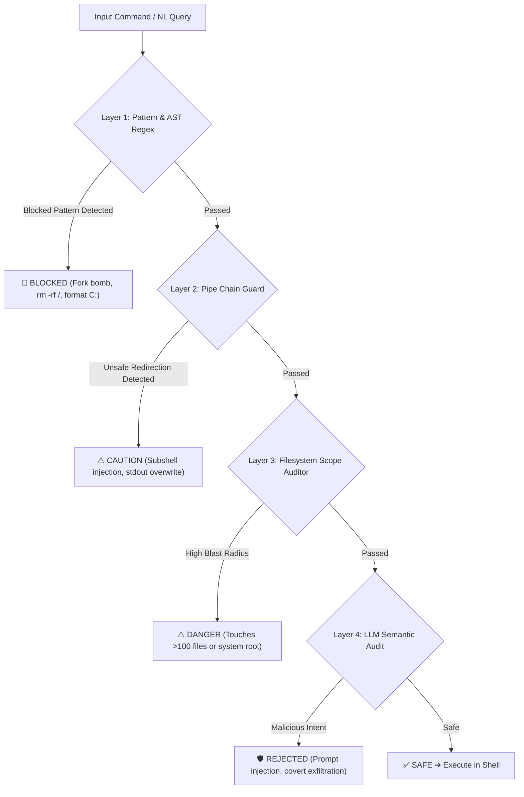

# 🏛️ NeuroShell — Architecture & Safety Deep Dive

This document details the internal architecture, security mechanisms, dual-engine inter-process communication (IPC), and 4-layer Zero-Trust safety shield powering **NeuroShell v5.6.0**.

---

## 📑 Table of Contents
1. [Dual-Engine Hybrid Architecture](#1-dual-engine-hybrid-architecture)
2. [4-Layer Zero-Trust Safety Shield](#2-4-layer-zero-trust-safety-shield)
3. [Sub-5ms Zero-Latency IPC Protocol](#3-sub-5ms-zero-latency-ipc-protocol)
4. [Viewport DLP & Real-Time Secret Masker](#4-viewport-dlp--real-time-secret-masker)
5. [Multi-LLM Router & Failover Engine](#5-multi-llm-router--failover-engine)
6. [Process Supervision & 0-Zombie Guarantee](#6-process-supervision--0-zombie-guarantee)

---

## 1. Dual-Engine Hybrid Architecture

NeuroShell employs a **decoupled, dual-engine architecture** that combines the raw performance of native C++20 with the flexible intelligence of Python:

```
┌────────────────────────────────────────────────────────────────────────────────────────┐
│                        NEUROSHELL NATIVE C++20 TERMINAL HOST                           │
│  • True Windows ConPTY API (`CreatePseudoConsole`) & POSIX `openpty`/`forkpty`         │
│  • Raw VT100 Console Engine • Keystroke Parsing (0.02ms latency) • Line Editor         │
│  • Ghost-Text Autocomplete • History Store (SQLite+FTS5) • Deep Jumper (`z <dir>`)    │
│  • Multi-Tab Supervisor • Win32 Job Object Process Manager                             │
└───────────────────────────────────────────┬────────────────────────────────────────────┘
                                            │
                                            │ Sub-Millisecond JSON-RPC 2.0 Protocol
                                            │ Windows: \\.\pipe\neuroshell_ipc
                                            │ POSIX:   ~/.neuroshell/ipc.sock
                                            ▼
┌────────────────────────────────────────────────────────────────────────────────────────┐
│                        PYTHON INTELLIGENCE & SAFETY DAEMON                             │
│  🧠 Multi-LLM Router (Groq, OpenAI, Anthropic, Gemini, Ollama, OpenRouter)             │
│  🛡️ 4-Layer Zero-Trust Safety Shield & SHA-256 Tamper-Proof Audit Chain                │
│  ⚡ 2,550+ Pre-Trained Offline Phrases (<0.5ms Instant Match Engine)                   │
│  🤖 Multi-Step Autonomous Agent & GitSandbox Engine                                    │
│  🔍 Output Parser (JSON/CSV/XML/Log/Stack Trace Diagnostic Extraction)                │
└────────────────────────────────────────────────────────────────────────────────────────┘
```

### Why Decoupled?
1. **Keystroke Performance**: The UI thread is 100% C++20 and never blocks on Python garbage collection or slow network calls.
2. **Instant Boot (<5ms)**: The C++ terminal displays the prompt in under 5ms, while the Python intelligence daemon boots asynchronously in a background thread.
3. **True Terminal Fidelity**: Full support for interactive, full-screen curses applications like `vim`, `nano`, `htop`, `tmux`, and `ssh`.

---

## 2. 4-Layer Zero-Trust Safety Shield

Every command—whether typed by a human, translated by an LLM, or suggested by an AI agent—must pass through the **4-Layer Safety Shield** before execution:



### The 4 Security Layers:
1. **Layer 1: AST & Blocked Pattern Matcher**:
   - Rejects known catastrophic patterns: `rm -rf /`, `:(){ :|:& };:`, `format c:`, `del /s /q c:\*`, `dd if=/dev/zero of=/dev/sda`.
2. **Layer 2: Pipe & Chain Analyzer**:
   - Evaluates sub-shell invocations (`$()`, `` ` ``), piped redirections (`> /dev/sda`, `> %SYSTEMROOT%`), and chained logical operators (`&&`, `||`).
3. **Layer 3: Filesystem Scope & Blast-Radius Auditor**:
   - Calculates the target directory depth and counts files that would be affected. If a command impacts system directories (`/etc`, `/usr`, `C:\Windows`) or touches $>100$ files, it prompts the user with an explicit danger confirmation.
4. **Layer 4: LLM Semantic Audit**:
   - For high-ambiguity prompts, the AI auditor analyzes the semantic intent to detect prompt injections, obfuscated base64 payloads, or covert reverse shells.

---

## 3. Sub-5ms Zero-Latency IPC Protocol

The C++ host communicates with the Python intelligence daemon via a custom **JSON-RPC 2.0 protocol**:

- **Windows**: High-speed Named Pipe (`\\.\pipe\neuroshell_ipc`).
- **macOS / Linux**: Unix Domain Socket (`~/.neuroshell/ipc.sock`).

### Sample IPC Request & Response:
```json
// C++ Host -> Python Daemon
{
  "jsonrpc": "2.0",
  "id": 1787084920,
  "method": "translate",
  "params": {
    "query": "kill whatever is on port 8080",
    "cwd": "C:\\Users\\dev\\project"
  }
}

// Python Daemon -> C++ Host (Response in <1ms for cached phrases)
{
  "jsonrpc": "2.0",
  "id": 1787084920,
  "result": {
    "command": "Stop-Process -Id (Get-NetTCPConnection -LocalPort 8080).OwningProcess -Force",
    "risk_level": "SAFE",
    "explanation": "Finds PID listening on TCP port 8080 and terminates it."
  }
}
```

---

## 4. Viewport DLP & Real-Time Secret Masker

NeuroShell includes a real-time **Data Loss Prevention (DLP)** engine built directly into the C++ terminal renderer. As text streams to your screen, it automatically detects and redacts:

- **OpenAI API Keys**: `sk-proj-********************************`
- **AWS Access Keys**: `AKIA****************`
- **GitHub Personal Access Tokens**: `ghp_************************************`
- **JSON Web Tokens (JWT)**: `eyJhbGciOi...[REDACTED_JWT]...`
- **Database Connection Passwords & Private Keys**

### Hotkey Control:
- Press **`[Ctrl+U]`** to toggle temporary unmasking if you need to copy or inspect the secret.
- Press **`[Ctrl+U]`** again to immediately re-mask.

---

## 5. Multi-LLM Router & Failover Engine

NeuroShell supports **6 enterprise AI providers** with automatic intelligent failover:

1. **Groq (Default / Ultra-Fast)**: Uses `llama-3.3-70b-versatile` with $<200\text{ms}$ time-to-first-token.
2. **OpenAI**: `gpt-4o`, `gpt-4o-mini`, `o1`.
3. **Anthropic**: `claude-3-5-sonnet-20241022`.
4. **Google Gemini**: `gemini-1.5-pro`, `gemini-2.0-flash`.
5. **Ollama (100% Offline / Air-Gapped)**: Connects to local models (`llama3.2`, `deepseek-r1`, `mistral`, `qwen2.5-coder`).
6. **OpenRouter**: Access to 100+ open-source models.

```
Request ──▶ Groq ──(if rate limit / network error)──▶ OpenAI ──▶ Gemini ──▶ Offline Phrases (<0.5ms)
```

---

## 6. Process Supervision & 0-Zombie Guarantee

When running multi-service workflows (`start frontend and backend`), child processes can easily become orphaned when interrupted in standard shells.

NeuroShell guarantees **0 zombie processes** through OS-level kernel encapsulation:
- **Windows**: Every spawned task tree is bound to a **Win32 Job Object** with `JOB_OBJECT_LIMIT_KILL_ON_JOB_CLOSE`. When you type `stop frontend` or exit the terminal, the Windows kernel terminates the entire process tree simultaneously.
- **macOS / Linux**: Tasks run inside dedicated **POSIX Process Groups (PGID)** with `kill(-pgid, SIGTERM)` propagation.
